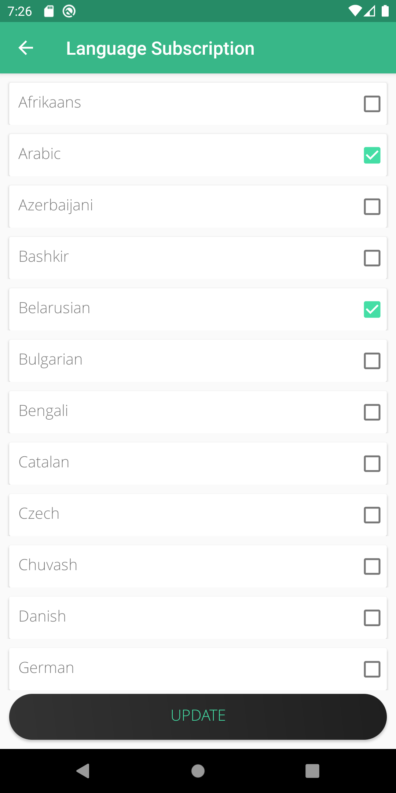

# Phraze

"A **notebook** and **translator** at the palm of your hand"

Phraze as stated above is a phrase translation app with the integration of text-to-speech, built for an assesment for a Mobile Application Development module at the Informatics Institute of Technology in collaboration with the University of Westminster.

***

## Screenshots





***

## Technologies used

**Built with**

* Java 1.8
* IBM Watson Language translator-8y
* IBM Text to Speech-qf
* SQLite

**Built on**

* Android Studio 3.5.3

***

## Features

### 1. Adding a phrase


The user is directed to the Add phrase screen selecting the "ADD PHRASE" button in the home page.
Adding a phrase has a text box where the user can enter a phrase of his/her liking which will be saved with the simple tap of the "SAVE" button. This page also displays the 3 most recent phrase additions into the application database. It can be toggled to visible or invisible state on click.

### 2. Editing a phrase


The user is directed to the Edit phrase screen selecting the "EDIT PHRASEs" button in the home page.
Editing a phrase can be done by selecting a phrase from the saved phrases where after the user selects the "EDIT" button, a text box with the current value of the phrase is shown as a place holder. The user can simply change the value within the text box and click on the "SAVE" button to save the new and edited text into the database. In case the user decides to cancel the editing of the phrase, the user can click on the cancel button shown with an "X".

### 3. Language subscription


The language subscription page as defined is a page that holds all the languages that the translator allows to translate. Here a list of languages with checkboxes for each languages can be seen, where the user can select the languages to be saved for phrase translation later on. The user can select the checkboxes to select the languages to subscribe to, and on clicking the "UPDATE" button the selected languages are saved.

### 4. Translator


One of the main features of Phraze, this page translates a selected phrase to a selected language. The user can select one phrase that needs to be translated, afterwards select a language and click on the "TRANSLATE" button to translate the phrase. 

### 5. Text to speech capabilities

Another main feature of Phraze which allows the user to convert text to speech and recite the translated word.

### 6. Saved translations


The last main feature of Phraze which on click of the "TRANSLATE ALL" button, all the phrases are translated to all the subscribed languages and are saved in the database for offline browsing of the translations. This page has a text to speech provided that an internet connection is available. The results in this page can be further filtered by the translation language by selecting a language from the spinner and clicking the "UPDATE" button

### 7. Display Phrases


This page displays all the saved phrases in the database. The list of phrases can be filtered by typing the item to search in the search bar.


***

## Code snippet for Translation

```java

        @Override
        protected String doInBackground(String... strings) {
            //error prevention using try-catch statements
            try {
                //getting the translation using IBM Watson Translator
                TranslateOptions translateOptions = new TranslateOptions.Builder()
                        .addText(strings[0])
                        .source(com.ibm.watson.language_translator.v3.util.Language.ENGLISH)
                        .target(strings[1])
                        .build();

                TranslationResult result = accessibilityHelper.getService().translate(translateOptions).execute().getResult();
                return result.getTranslations().get(0).getTranslation();
            } catch (Exception e) {
                return "";
            }
        }
```
***
## Installation

1. Create a free IBM Cloud account at the following website:
https://cloud.ibm.com/

2. After you login, click on the "IBM Cloud" link on the top left and from the navigational menu choose Dashboard.

3. Add the following 2 Web Services (Resources) to your account     (choose the Free Service for both)
: 

    a) "Language Translator"
     
    b) "Text to Speech" 

4. Clone the repo, open the project in Android Studio

5. Get your API keys and URL for both services and open the "**strings.xml**" file in **"/res/values"** directory and change the following with the respective values.

```
    a) language_translator_apikey

    b) language_translator_url

    c) text_speech_apikey

    d) text_speech_url
```

6. Hit "Run". Done!

***

## API References

https://cloud.ibm.com/apidocs/language-translator

https://cloud.ibm.com/apidocs/text-to-speech


